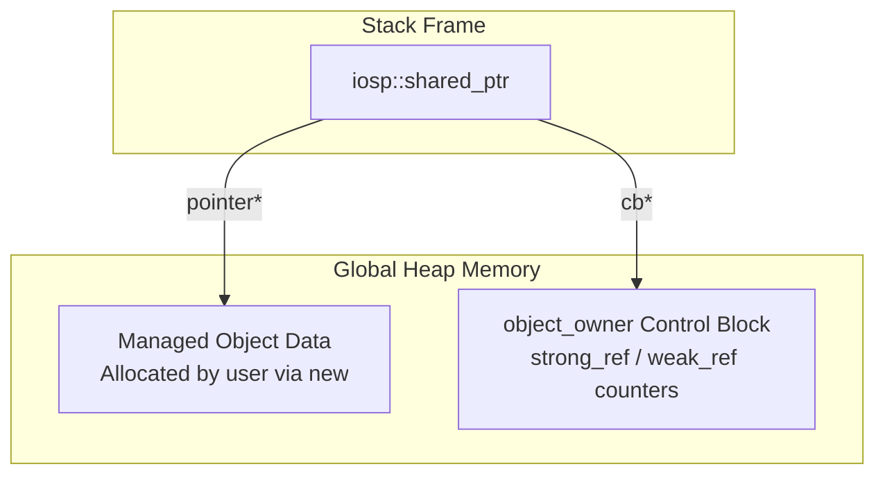
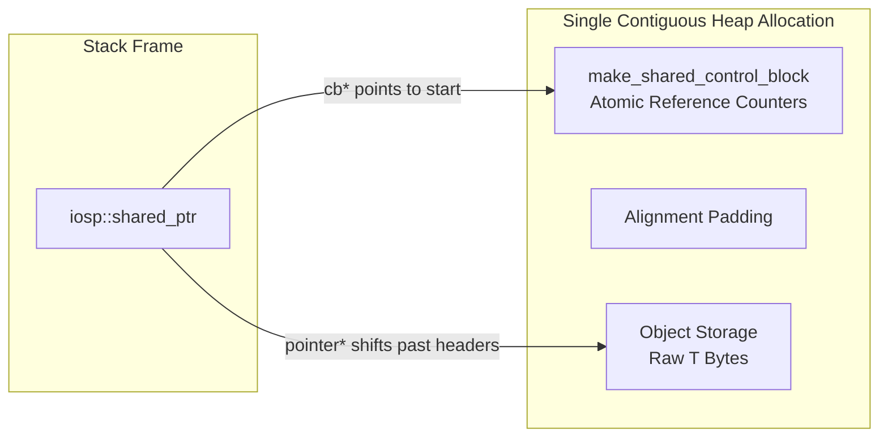

Markdown
# Smart-Pointers

A lightweight, standard-compliant, header-only implementation of custom smart pointers (`unique_ptr` and `shared_ptr`) written in modern C++ (C++17/20). This project focuses on low-level systems programming techniques, featuring optimized single-allocation mechanics for `make_shared`, type-erased control blocks, and custom allocator support via template allocator rebinding.

## 🚀 Key Features

* **`unique_ptr<T>`**: Zero-overhead RAII wrapper for exclusive resource ownership, featuring support for array specializations (`T[]`) and customizable deleters.
* **Polymorphic Control Blocks**: A robust `shared_ptr` architecture that utilizes dynamic type erasure to isolate pointer metadata from standard operations.
* **Optimized `make_shared`**: Implements single-allocation memory packing to guarantee spatial cache locality and eliminate redundant kernel heap requests.
* **Allocator Awareness**: Full integration with `std::allocator_traits` to redirect internal control block metadata mapping into custom memory pools or arenas.
* **Thread-Safe Reference Counting**: Powered by lock-free `std::atomic_size_t` structures for thread-safe ownership tracking.

---

## 📐 Memory Architecture

The library implements two distinct memory topologies underneath the hood based on construction semantics:

### 1. Split Allocation (`shared_ptr<T>(new T)`)
When a raw heap pointer is passed explicitly, ownership is transferred to an internal `object_owner` control block. This creates two separate allocations on the heap:

```markdown

---

```markdown
### 2. Contiguous Contoured Memory (`make_shared<T>`)
To optimize cache locality and drop down to a single OS kernel allocation request, `make_shared` packs the control block headers and the object storage into one contiguous block of bytes:



---

## 🛠️ Low-Level Implementations Highlighted

### Type Erasure via Core Abstract Interfaces
To hide customized behavior from the user-facing `shared_ptr<T>` class template, the management layer relies on an abstract base interface (`control_block`). Specific lifecycles are handled through derived polymorphic structs:
* `object_owner`: Managed standard heap allocations.
* `object_owner_alloc`: Routes cleanup mechanics through isolated custom memory systems via template allocator rebinding traits.

### Allocator Rebinding Mechanics
The implementation utilizes `std::allocator_traits::rebind_alloc` to dynamically morph incoming allocators typed for generic objects into engine blocks capable of stamping out exact control block structures:
```cpp
using Alloc = typename std::allocator_traits<Allocator>::template rebind_alloc<object_owner_alloc<Ptr, Deleter, Allocator>>;
💻 Usage Examples
1. Exclusive Ownership with Unique Pointers

C++
#include "unique_ptr.hpp"
#include <iostream>

struct Vector3D {
    float x, y, z;
    Vector3D(float x, float y, float z) : x(x), y(y), z(z) {}
};

int main() {
    // Basic instantiation
    auto u1 = iosp::make_unique<Vector3D>(1.0f, 2.0f, 3.0f);
    std::cout << "Vector: " << u1->x << ", " << u1->y << "\n";

    // Safe ownership transfer via move semantics
    iosp::unique_ptr<Vector3D> u2 = std::move(u1); 
    assert(u1.get() == nullptr); 
}

2. Shared Ownership & Cache-Optimized Creation

C++
#include "shared_ptr.hpp"
#include <cassert>

int main() {
    // Single allocation construction
    auto s1 = iosp::make_shared<int>(42);
    assert(s1.use_count() == 1);

    {
        iosp::shared_ptr<int> s2 = s1; // Implicit atomic counter increment
        assert(s1.use_count() == 2);
        assert(*s2 == 42);
    } // s2 leaves scope; counter automatically decrements

    assert(s1.use_count() == 1);
} // Last counter dropped; memory block freed cleanly
```
🔧 Building and Requirements
Compiler: C++17 compliant compiler or newer (GCC 9+, Clang 10+, MSVC 2019+).

Configuration: This is a header-only library. Simply copy the iosp files directly into your project's include path.

```Bash
# Compilation flags recommendation for validating memory layout integrity
g++ -std=c++17 -Wall -Wextra main.cpp -o pointer_test
```

*Note: This repository represents a deep-dive into first-principles C++ systems programming. While the entire codebase is written manually, the technical write-up and memory architecture diagrams were structured with the assistance of AI to ensure optimal clarity and readability.*